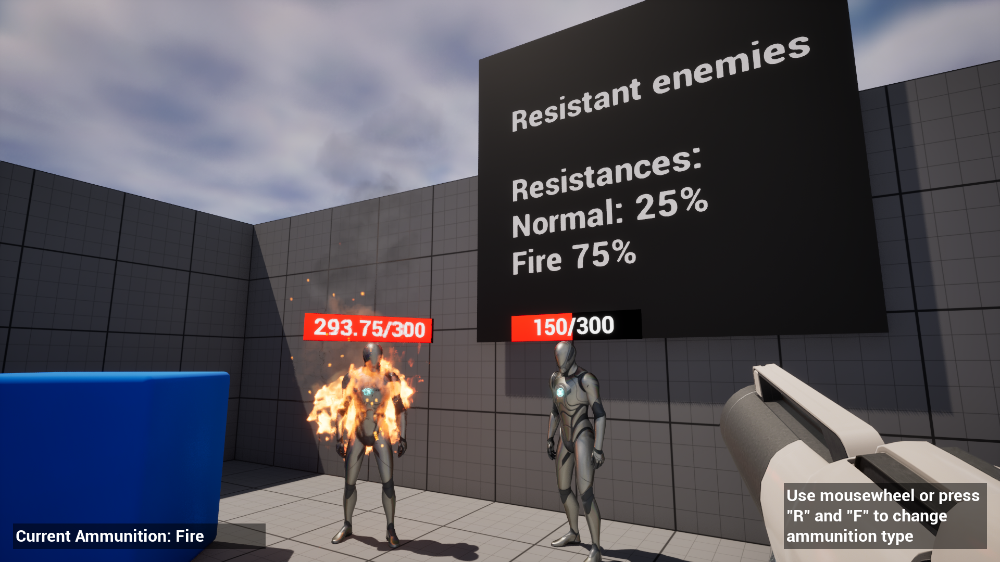

## Minimal example of UE5's Gameplay Ability System (GAS)
This project aims to show how to use GAS to easily add a health system to arbitrary actors including damage types and resistances. Throughout the example, Epic's naming conventions for code and assets are followed.

## Project's features:
- Based on C++ First Person template.
- **Gameplay Ability System** is used to handle attributes and gameplay effects.
- 4 ammunition types:
    - **Normal** - deals 20 damage.
    - **Fire** - deals 10 damage and applies OnFire effect, which deals 5 damage every second for 4 seconds.
    - **Water** - doesn't deal any damage; removes OnFire effect.
    - **Healing** - restores 10 health

    Each ammunition type is stored as a DataAsset (`UDemoAmmunitionType`) and can be used to dynamically generate gameplay effect specs.
- Actors may be resistant to Normal and Fire damage (ranging from 0% to 100%).
- Enemy actors have health bars.
- A simple event system example.
- Simple logging.

## Control scheme:
<table>
    <tr>
        <td>Movement</td>
        <td>WSAD</td>
    </tr>
    <tr>
        <td>Jump</td>
        <td>Spacebar</td>
    </tr>
    <tr>
        <td>Shooting</td>
        <td>Left Mouse Button</td>
    </tr>
    <tr>
        <td>Next Ammunition type</td>
        <td>
            Mouse Wheel Up, R  
        </td>
    </tr>
    <tr>
        <td>Previous Ammunition type</td>
        <td>
            Mouse Wheel Down, F  
        </td>
    </tr>
</table>